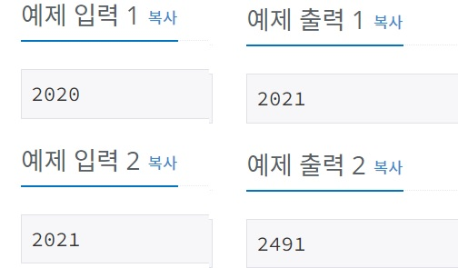

# 2021은 무엇이 특별할까
[문제링크](https://www.acmicpc.net/problem/24039)

## 1. 문제 설명

### 1.1 문제요약
- 백준 온라인 저지의 송년대회 Good Bye BOJ, 2021!의 개최일은 2021년 12월 31일이다. 원이는 대회가 개최된다는 사실이 기뻐 제목을 뚫어져라 보다가 2021이 무언가 특별하다는 사실을 깨달았다.

- 그렇다. 2021은 연속한 두 소수 43과 47의 곱이다. 다음에 이런년도가 오려면 무려 470년 뒤인 2491년이 되어야 한다. 원이는 어떤 수가 연속한 두 소수의 곱으로 이루어져 있으면 특별한 수라 부르기로 하였다.

- 주어진 수보다 큰 특별한 수 중 가장 작은 수를 구하는 프로그램을 작성하시오.

### 1.2 입출력 방식 
- 첫 번째 줄에 주어진 수 N이 주어진다.

- 첫 번째 줄에 N보다 큰 특별한 수 중 가장 작은 수를 출력하여라.
### 1.3 입출력 예시

## 2. 문제해결 아이디어

### 2.1 소수를 걸러낸다.

### 2.2 소수들을 차례대로 곱해보면서 N보다 크면 출력한다.