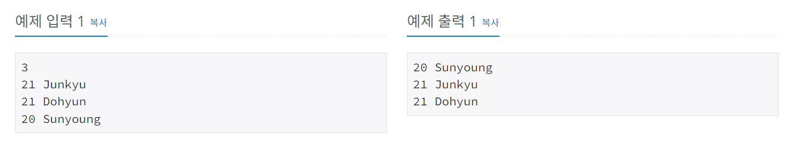

# 나이순 정렬
[문제링크](https://www.acmicpc.net/problem/10814)

## 1. 문제 설명

### 1.1 문제요약
- 온라인 저지에 가입한 사람들의 나이와 이름이 가입한 순서대로 주어진다. 이때, 회원들을 나이가 증가하는 순으로, 나이가 같으면 먼저 가입한 사람이 앞에 오는 순서로 정렬하는 프로그램을 작성하시오.
### 1.2 입출력 방식 
- 첫째 줄에 온라인 저지 회원의 수 N이 주어진다. (1 ≤ N ≤ 100,000)

- 둘째 줄부터 N개의 줄에는 각 회원의 나이와 이름이 공백으로 구분되어 주어진다. 나이는 1보다 크거나 같으며, 200보다 작거나 같은 정수이고, 이름은 알파벳 대소문자로 이루어져 있고, 길이가 100보다 작거나 같은 문자열이다. 입력은 가입한 순서로 주어진다.

- 첫째 줄부터 총 N개의 줄에 걸쳐 온라인 저지 회원을 나이 순, 나이가 같으면 가입한 순으로 한 줄에 한 명씩 나이와 이름을 공백으로 구분해 출력한다.
### 1.3 입출력 예시

## 2. 문제해결 아이디어

### 2.1 회원나이, 회원이름, 회원 등록순서를 모두 받아준다.
- 리스트 안에 [나이, 이름, 등록순서] 와 같은 리스트 형태로 받아준다.

### 2.2 나이와 등록순서에 대해서 정렬한다.
- lambda를 이용하여 키값으로 정렬한다.

### 2.3 정렬된 리스트에서 나이와 이름만 출력한다.
- 순서대로 나이와 이름만 출력한다.