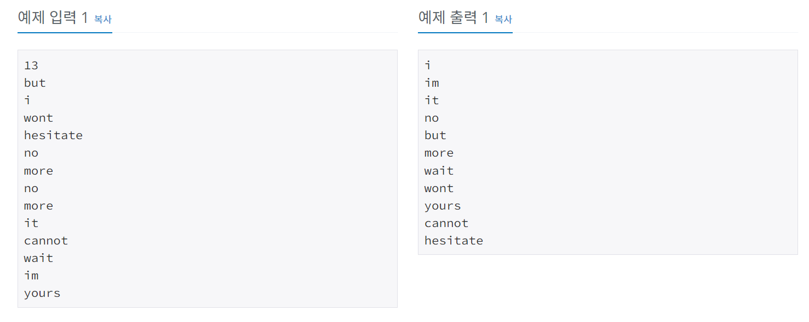

# 단어정렬
[문제링크](https://www.acmicpc.net/problem/1181)

## 1. 문제 설명

### 1.1 문제요약
- 알파벳 소문자로 이루어진 N개의 단어가 들어오면 아래와 같은 조건에 따라 정렬하는 프로그램을 작성하시오.

1. 길이가 짧은 것부터
2. 길이가 같으면 사전 순으로
### 1.2 입출력 방식 
- 첫째 줄에 단어의 개수 N이 주어진다. (1 ≤ N ≤ 20,000) 둘째 줄부터 N개의 줄에 걸쳐 알파벳 소문자로 이루어진 단어가 한 줄에 하나씩 주어진다. 주어지는 문자열의 길이는 50을 넘지 않는다.

- 조건에 따라 정렬하여 단어들을 출력한다. 단, 같은 단어가 여러 번 입력된 경우에는 한 번씩만 출력한다.
### 1.3 입출력 예시

## 2. 문제해결 아이디어

### 2.1 단어를 정렬하기 위한 조건 2개를 다 받아준다.
- 길이 순으로 정렬하기 위해서 단어의 길이를 받아준다.
- 길이가 같을 때는 사전 순이므로, 사전순으로 정렬하기 위해 문자열을 그대로 받아준다.
- 조건 2개를 받을 때 튜플로 받아서 list에 넣어준다.

### 2.2 set으로 중복제거 한 뒤에 정렬한다.
- 정렬하면 자동적으로 len(S), S 에 대해 모두 정렬된다.