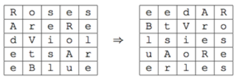
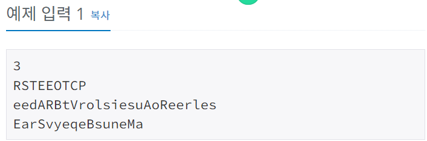
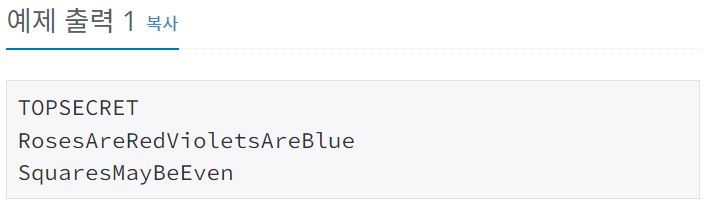

# 비밀 편지
[문제링크](https://www.acmicpc.net/problem/5426)

## 1. 문제 설명

### 1.1 문제요약
- 선영이는 남자친구를 위해 연애 편지를 썼다. 선영이는 편지가 남들에게 읽히는 것을 막기 위해서 편지를 암호화하려고 한다.

- 먼저, 편지의 내용을 정사각형에 작성한다. 그 다음, 시계방향으로 90도 회전시킨다. 그 다음, 첫 행부터 마지막 행까지 순서대로 다시 편지를 작성한다. 선영이는 싸이월드 세대이기 때문에, 편지에 띄어쓰기를 쓰지 않는다.

- 예를 들어, 편지의 내용이 "RosesAreRedVioletsAreBlue"인 경우에, 암호화한 편지는 "eedARBtVrolsiesuAoReerles" 이 된다.

- 선영이가 암호화한 편지가 주어졌을 때, 원래 내용을 구하는 프로그램을 작성하시오..

### 1.2 입출력 방식 
- 첫째 줄에 테스트 케이스의 개수가 주어진다. 테스트 케이스의 수는 최대 100개이다.

- 각 테스트 케이스는 한 줄로 이루어져 있으며, 암호화된 편지가 주어진다. 편지는 알파벳 소문자와 대문자로만 이루어져 있으며, 길이는 1보다 크거나 같고, 10,000보다 작거나 같으며, 항상 제곱수이다.

- 각 테스트 케이스마다 원래 메시지를 출력한다.
### 1.3 입출력 예시

## 2. 문제해결 아이디어

### 2.1 제곱근을 취해서 n x n 의 정사각형으로 끊는다.
- 제곱근을 취해서 그 숫자만큼 문자열을 끊어간다.