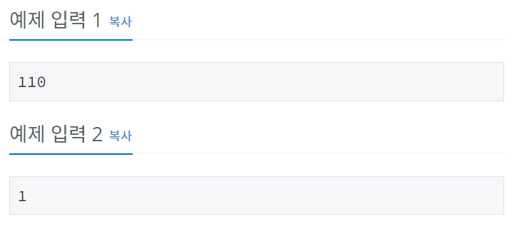
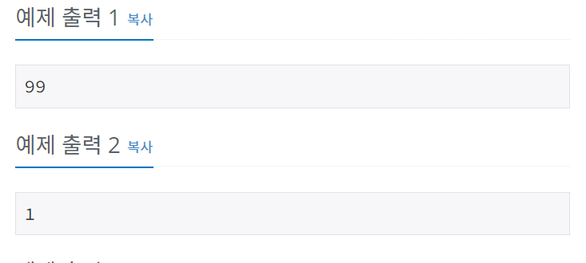

# 한수
[문제링크](https://www.acmicpc.net/problem/1065)

## 1. 문제 설명

### 1.1 문제요약
- 어떤 양의 정수 X의 각 자리가 등차수열을 이룬다면, 그 수를 한수라고 한다. 등차수열은 연속된 두 개의 수의 차이가 일정한 수열을 말한다. N이 주어졌을 때, 1보다 크거나 같고, N보다 작거나 같은 한수의 개수를 출력하는 프로그램을 작성하시오. 

### 1.2 입출력 방식 
- 첫째 줄에 1,000보다 작거나 같은 자연수 N이 주어진다.

- 첫째 줄에 1보다 크거나 같고, N보다 작거나 같은 한수의 개수를 출력한다.
### 1.3 입출력 예시

## 2. 문제해결 아이디어

### 2.1 등차수열을 이루는 수를 찾는다.
- 두자리 수까지는 등차수열을 무조건 이룬다.
- 세자리 수부터는 등차수열을 이루는지 확인해주고, 해당하는 것만 출력한다.