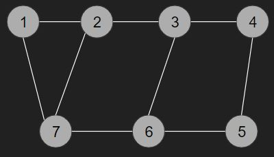
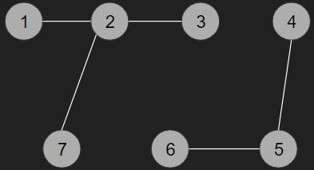
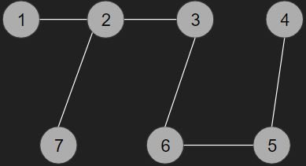

# [BOJ] 도시 분할 계획

문제링크: [https://www.acmicpc.net/problem/1647](https://www.acmicpc.net/problem/1647)

 

## 🔍 문제분석

하나의 마을에는 집이 모두 한 도로나 그이상의 도로로 연결되어 있다. 이 상태에서 도로를 없애서 두개의 연결되지 않은 마을을 만들고 최소 도로유지비용으로 만드는것이 목표이다.

1. 처음 마을의 모습

2. 최소 유지비용의 도로들만 남기고 두개의 마을로 나눈 후의 모습

 
 

## 💡 아이디어

> kruskal 알고리즘을 사용한다.

1. 집과 집들을 연결하는 도로를 입력으로 받는다.

2. 최소 비용의 도로들로 사이클이 없는 트리를 만든다.

3. 트리에서 가장 비용이 높은 간선하나를 제거한다.

