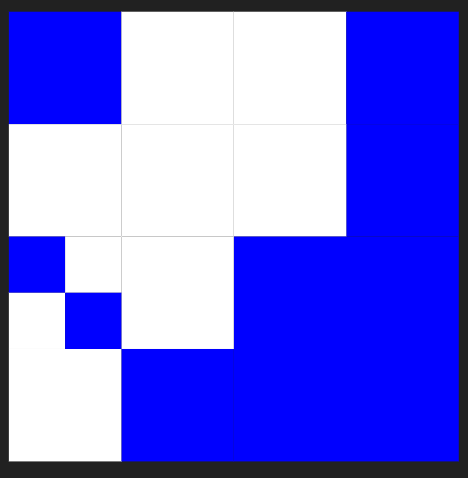
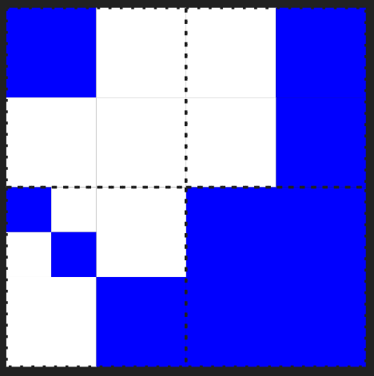
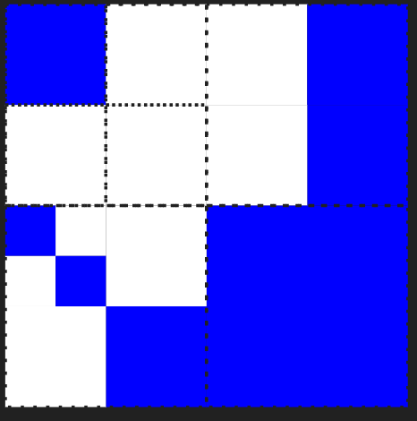
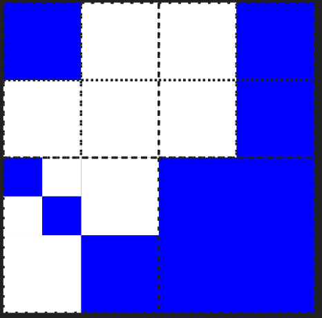
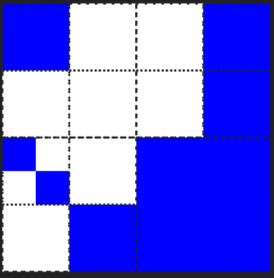
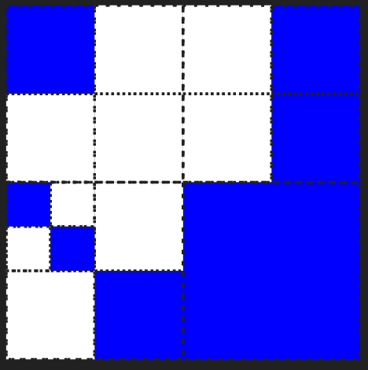

# [BOJ] 색종이 만들기
문제링크: [https://www.acmicpc.net/problem/2630](https://www.acmicpc.net/problem/2630)

 

## 🔍 문제분석

- 색종이를 사분면으로 나눈다.
- 각 면에서 두개의 색으로 구성된 면은 다시 사분면으로 나눈다.

 

## 💡 아이디어

> 재귀 함수를 활용한다.

알고리즘 진행 과정

