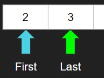
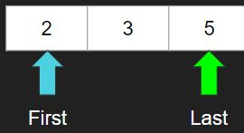
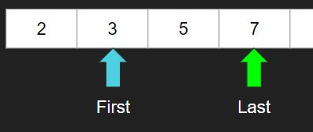
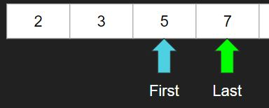
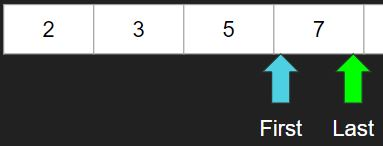

# [BOJ] 소수의 연속합

문제링크: [https://www.acmicpc.net/problem/1644](https://www.acmicpc.net/problem/1644)

<br/>

## 🔍 문제분석

수가 입력되면 그 수를 연속된 소수의 합으로 만들 수 있는 경우의 수를 출력한다.

```
// 입력
20

//출력
0

------

//입력
41

//소수의 합 경우
2+3+5+7+11+13
11+13+17
41

//출력
3
```

<br/>
<br/>

## 💡 아이디어

1, 2, 3의 경우에는 각각 0, 1, 1이 나오도록 하고 나머지는 큰 수들은 다음의 플로우를 따른다.

예) 입력이 10일 경우

1. 처음에 리스트에 2와 3이 있고 first 포인터와 last포인터가 처음과 끝을 가리킨다.



2. 처음과 끝까지의 합을 입력값과 비교한다.

```
2+3 = 5 < 10
```

3. 입력값보다 작다면 리스트 끝에 다음 소수를 추가하고 last 포인터를 뒤로 옮긴다.



4. 아까 구한 합에다가 새로운 값을 더하고 다시 비교한다.

```
5 + 5 = 10
```

5. 10이므로 1을 하나 카운트하고 first와 last를 다음으로 옮기고 다시 구한 합에다가 first 이전에 요소를 빼고 새로운 last 값을 더한 뒤에 비교한다.



```
10 - 2 + 7 = 15 > 10
```

6. 입력값보다 크면 first를 뒤로 옮기고 비교한다.



```
15 - 3 = 12 > 10
```

7. 입력값보다 크므로 한번더 옮기고 비교한다.



```
12 - 5 = 7 < 10
```

8. 입력값보다 작으므로 다음 소수를 리스트에 넣어야하지만 11은 10보다 크므로 중단한다.

9. 마지막으로 10이 소수인지 검사하고 소수라면 1을 더 카운트하고 아니면 이때까지 카운트된 값을 출력한다.

```
1
```