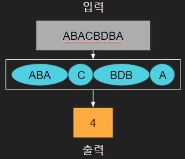
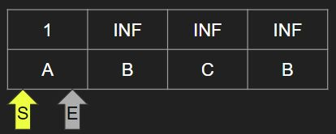
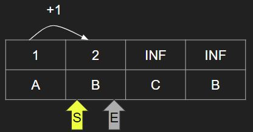
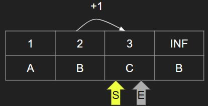
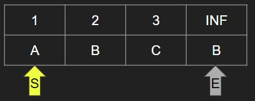
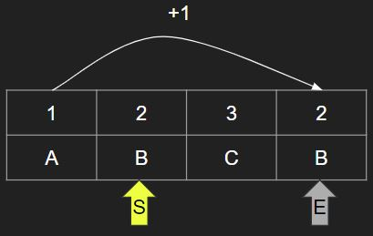

# [BOJ] 펠린드롬 분할
문제링크: [https://www.acmicpc.net/problem/1509](https://www.acmicpc.net/problem/1509)

 

## 🔍 문제분석

- 입력받은 문자열에서 펠린드롬 문자열들을 묶어 놓았을 때 묶음의 최소 개수를 구하는 문제

 

## 💡 아이디어

1. 먼저 문자열에서 Start 포인터와 End 포인터가 있고 처음에는 첫번째 문자를 가리키고 있다. 처음에는 "A"하나만 있으므로 펠린드롬 갯수 리스트에는 1을 저장한다. 그리고 나머지 요소들은 아직 안정해졌으므로 무한대(INF)로 정한다. 

2. End 포인터를 한칸 뒤로 옮기고 Start 포인터는 처음으로 되돌린다.

3. S포인터부터 E포인터까지의 문자열이 펠린드롬인지 검사하고 펠린드롬이 아니라면 S포인터를 한칸 뒤로 옮긴다.

4. S포인터에서 E포인터까지의 문자열인 "B"는 펠린드롬이므로 S포인터 이전 요소까지의 펠린드롬 개수에서 1을 더한값을 E포인터 요소에 저장한다.

5. 위의 과정을 반복해서 마지막 요소의 펠린드롬 개수를 구할 때까지 진행한다.

따라서 "ABCB"의 출력값은 2이다.